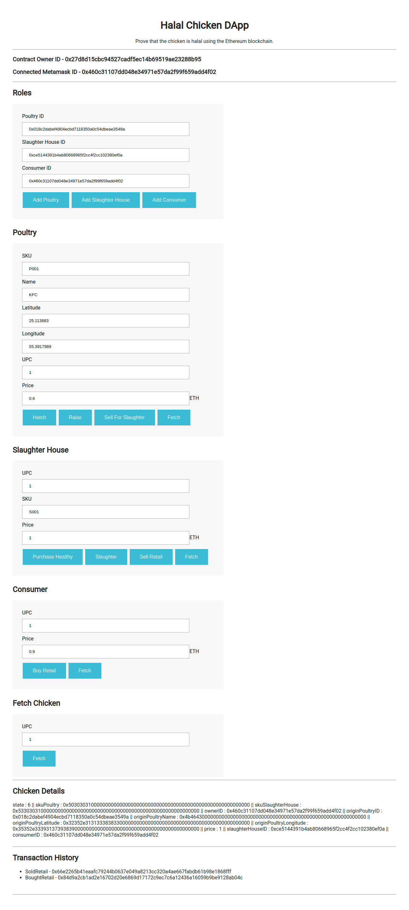
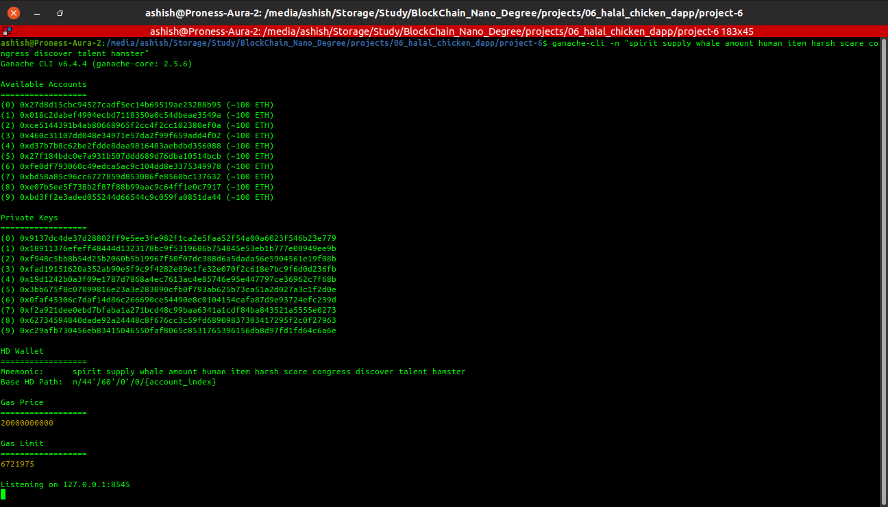
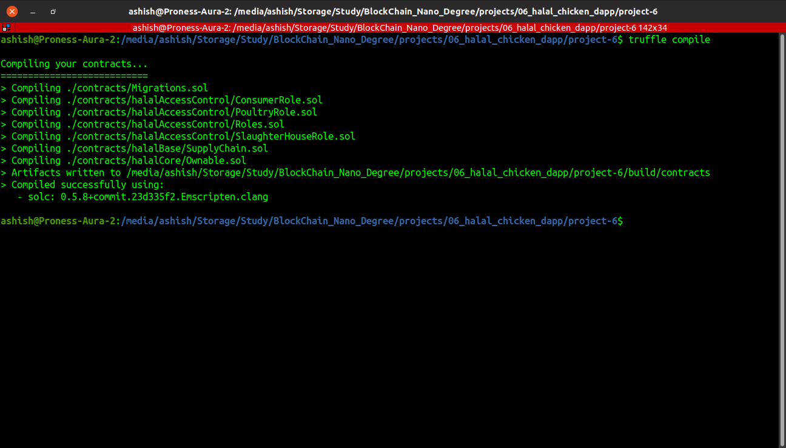
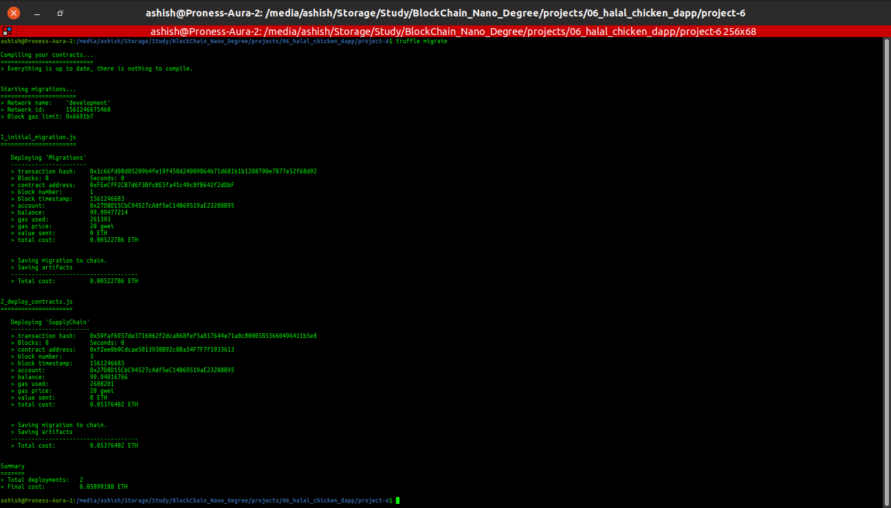
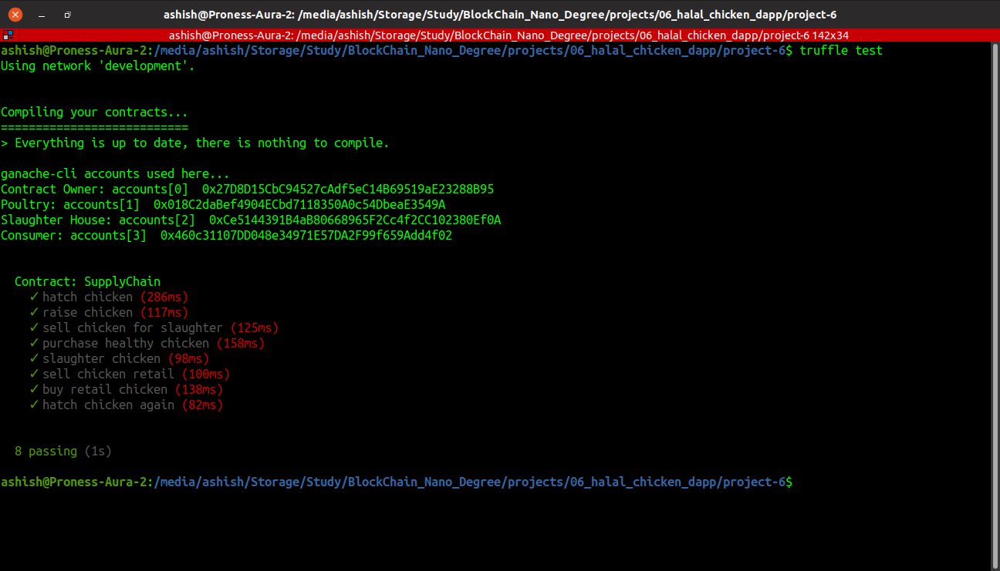

# Supply chain & data auditing

This repository containts an Ethereum DApp that demonstrates a Supply Chain flow. A poultry can add new chickens to the inventory system stored in the blockchain. Slaughter House can purchase a healthy chicken from the poultry. It can then slaughter the chicken in a halal way and then sell the halal chicken to consumers.

The DApp User Interface when running should look like...



## Getting Started

These instructions will get you a copy of the project up and running on your local machine for development and testing purposes. See deployment for notes on how to deploy the project on a live system.

### Prerequisites

Please make sure you've already installed NodeJS, ganache-cli, Truffle and enabled MetaMask extension in your browser. If you want / have multiple versions of NodeJS on your system, [Node Version Manager (nvm)](https://github.com/nvm-sh/nvm) is a very handy tool. You'll need 4 different accounts on your MetaMask to test all stages of the halal chain. You may use the accounts mentioned in [0_ganache-cli.txt](0_ganache-cli.txt).

### Installing

A step by step series of examples that tell you have to get a development env running

Clone this repository:

```
git clone https://github.com/udacity/nd1309/tree/master/course-5/project-6
```

Change directory to ```project-6``` folder and install all requisite npm packages (as listed in ```package.json```):

```
cd project-6
npm install
```

Launch Ganache:

```
ganache-cli -m "spirit supply whale amount human item harsh scare congress discover talent hamster"
```

Your terminal should look something like this:



In a separate terminal window, Compile smart contracts:

```
truffle compile
```

Your terminal should look something like this:



This will create the smart contract artifacts in folder ```build\contracts```.

Migrate smart contracts to the locally running blockchain, ganache-cli:

```
truffle migrate
```

Your terminal should look something like this:



Test smart contracts:

```
truffle test
```

All tests should pass.



In a separate terminal window, launch the DApp:

```
npm run dev
```

## Built With

* [Ethereum](https://www.ethereum.org/) - Ethereum is a decentralized platform that runs smart contracts
* [Truffle Framework](http://truffleframework.com/) - Truffle is the most popular development framework for Ethereum with a mission to make your life a whole lot easier.


## Acknowledgments & Versions

* Solidity (v0.5.8)
* Ganache-cli (v6.4.4, core v2.5.6)
* Truffle (v5.0.24)
* NodeJS (v10.16.0)
* NPM (6.9.0)

## Testnet Deployment details

* Contract Address: [0x4E17bBf4a2B47361965BE8a04d97A6CC4A272C9c](https://rinkeby.etherscan.io/address/0x4e17bbf4a2b47361965be8a04d97a6cc4a272c9c)
* Deployment tx hash: [0xb26958c0c3709990192d5a418d0af00df610e744a90c3e5e4cb97e166243277a](https://rinkeby.etherscan.io/tx/0xb26958c0c3709990192d5a418d0af00df610e744a90c3e5e4cb97e166243277a)
* Network: Rinkeby
